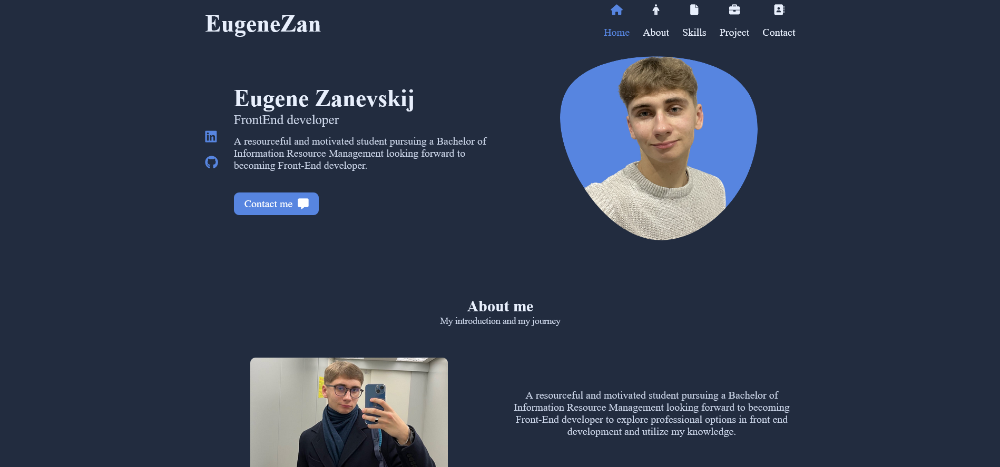
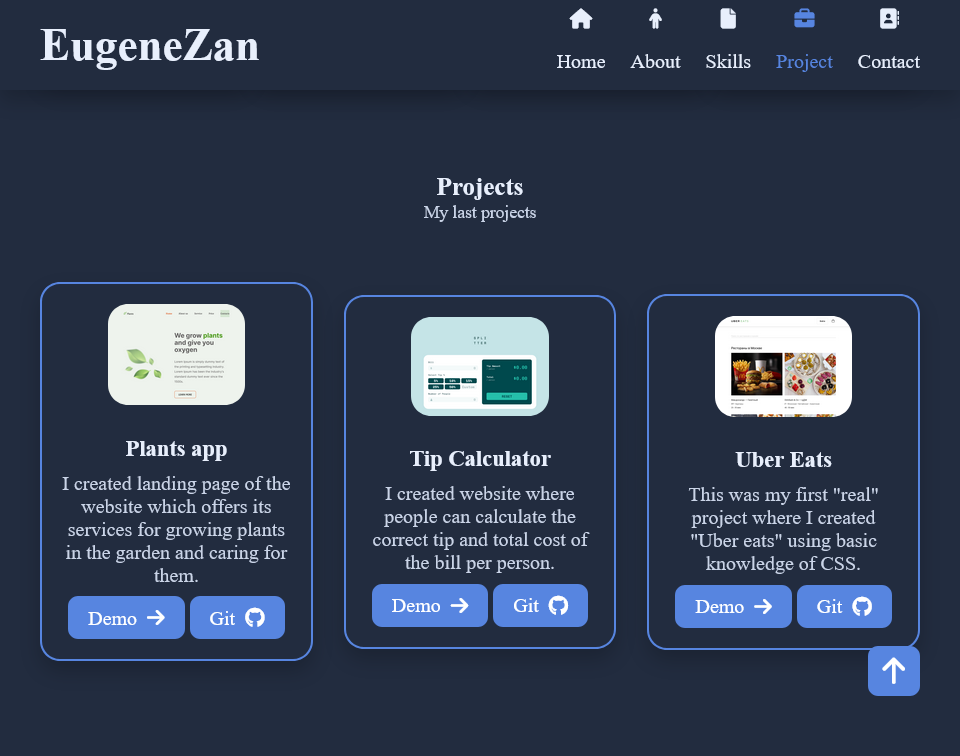

# Responsive Portfolio Website


# [Portfolio page](https://eugenezanevskij.github.io/portfolio-page/)

A portfolio website is a unique way to showcase work and let others know about myself. It's a platform for projects, and information about me.

## Key points:

- Responsive Personal Portfolio Website Using HTML SCSS & JavaScript
- Smooth scrolling in each section.
- Developed first with the Mobile First methodology, then for desktop.
- Compatible with all mobile devices and with a beautiful and pleasant user interface.
- Built using BEM methodology- valid semantic adaptive layout
- Using JavaScript to implement the functionality

## Table of contents

- [Overview](#overview)
  - [The challenge](#the-challenge)
  - [Screenshot](#screenshot)
  - [Links](#links)
- [My process](#my-process)
  - [Built with](#built-with)
  - [What I learned](#what-i-learned)
  - [Continued development](#continued-development)
  - [Useful resources](#useful-resources)
- [Author](#author)

## Overview

### The challenge

- View the optimal layout depending on their device's screen size
- See hover and focus states for interactive elements
- See responsive navbar
- Scroll sections active link

### Screenshot

Desktop version



There's section "Projects" with some examples of my work



### Links

- Solution URL: [Portfolio page](https://github.com/EugeneZanevskij/portfolio-page)
- Live Site URL: [Portfolio page](https://eugenezanevskij.github.io/portfolio-page/)

## My process

### Built with

- Semantic HTML5 markup
- CSS custom properties
- Flexbox
- Mobile-first workflow
- BEM
- SCSS
- npm sass
- JS
- DOM API

### What I learned

This was the project in which I tried to use lots of JS.
The coolest thing I did was this scroll sections active link functionality:

```js
const sections = document.querySelectorAll('section[id]')

function scrollActive(){
    const scrollY = window.pageYOffset;

    sections.forEach(current =>{
        const sectionHeight = current.offsetHeight;
        const sectionTop = current.offsetTop - 72;
        const sectionId = current.getAttribute('id');
        if(scrollY >= sectionTop && scrollY <= sectionTop + sectionHeight){
            document.querySelector('.nav__menu a[href*=' + sectionId + ']').classList.add('active');
        }else{
            document.querySelector('.nav__menu a[href*=' + sectionId + ']').classList.remove('active');
        }
    })
}
window.addEventListener('scroll', scrollActive);
```

Working on this project I also worked with `npm sass`.

### Continued development

In future projects I want to focus more on using JS and API in my work, start building React apps.

### Useful resources

- [Sass Guidelines](https://sass-guidelin.es/) - An opinionated styleguide for writing sane, maintainable and scalable Sass.
- [Sass Basics](https://sass-lang.com/guide) - Basics on how to transform SCSS into CSS using terminal.
- [BEM](https://css-tricks.com/bem-101/) - Basics of BEM methodology.

## Author

- LinkedIn - [Eugene Zanevskij](https://www.linkedin.com/in/eugene-zanevskij/)
- GitHub - [@EugeneZanevskij](https://github.com/EugeneZanevskij)